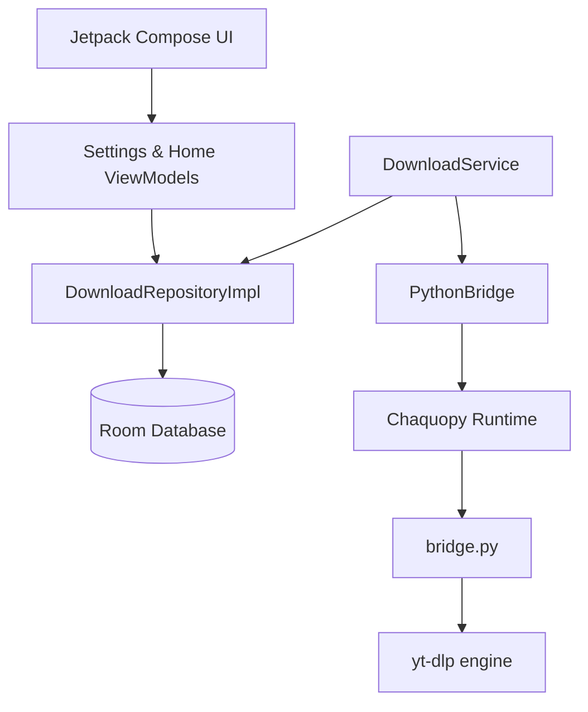

# Vidown

Vidown is a modern Android application for downloading video and audio from popular media platforms. Built with Kotlin, Jetpack Compose, and Chaquopy, it wraps the powerful `yt-dlp` core engine into a clean, Material Design 3 mobile interface.

## Features

### Core Downloader

- **Powered by yt-dlp**: Native integration with the industry-standard command-line media extraction utility.
- **Parallel Downloads**: Scheduled multi-threaded queue (configured via `maxConcurrentDownloads`) running downloads concurrently using `Coroutines` and a thread-safe tracker.
- **Speed Limiting (Throttling)**: Limit download speeds (presets: Unlimited, 100 KB/s, 500 KB/s, 1 MB/s, 2 MB/s, 5 MB/s) to save network bandwidth.
- **Custom Storage Locations**: Uses Android's Storage Access Framework (SAF) to let users select custom download folders (e.g. SD cards or external directories), falling back gracefully to public Movies/Music directories.
- **Dynamic Format Selector**: Choose from best quality, specific resolutions (1080p, 720p, 480p), or audio-only extraction.

### Subtitles Integration

- **Mux Subtitles**: Download and embed subtitles directly into video containers.
- **Language Preferences**: Select preferred languages (e.g. English, Spanish, French, Chinese, Japanese, etc.) using a multi-select dialog, or specify custom comma-separated lang codes.

### Account Logins

- **Secure Google Login**: Uses a desktop Firefox User-Agent routing split to bypass Google's disallowed WebView checks, allowing secure login and session cookie recording for YouTube.
- **TikTok Login Redirect Fix**: Employs a mobile Safari User-Agent to render light login screens, combined with a custom protocol scheme interceptor to handle intent redirects (`tiktok://`, `snssdk1128://`) without freezing the browser context.
- **Instagram & X (Twitter) Logins**: Standard desktop Chrome WebView setups capturing session cookies.

### System Integration & UI

- **Material 3 Design**: Elevated cards, inline expandable preference selectors, and edge-to-edge system navigation.
- **Actionable Notifications**: Real-time notifications updating aggregate active progress percentages, featuring quick-action targets (Play completed videos, Share files, or Retry failed tasks).
- **Engine Updates**: In-app OTA engine checker to retrieve and compile the latest `yt-dlp` releases directly from GitHub.

---

## Architecture Overview

### 1. Presentation Layer (Kotlin Compose)

- **`HomeScreen`**: Paste url, fetch formats, and queue downloads.
- **`DownloadsScreen`**: View active queue, completed files, and failed states.
- **`SettingsScreen`**: Manage default quality, speed limits, download location, accounts, and system updates.

### 2. Service & Scheduling Layer (Kotlin Coroutines)

- **`DownloadService`**: A background service coordinating concurrent downloads. Maintains active jobs via `ConcurrentHashMap` and runs tasks in parallel coroutines up to the user-configured limit. Updates notifications dynamically using aggregate progress calculations.
- **`NotificationActionReceiver`**: Listens for notification actions (`PLAY`, `SHARE`, `RETRY`), starting default media viewers or updating the database to requeue failed tasks.

### 3. Execution Bridge (Chaquopy)

- **`PythonBridge.kt`**: Wraps the Python runtime. Initiates format extractions (`fetchInfo`) and downloads (`startDownload`) by calling `bridge.py` on background threads.
- **`bridge.py`**: Interacts with the `yt-dlp` Python library, mapping options (such as `ratelimit`, `cookiefile`, `subtitleslangs`) and streaming progress updates back to Kotlin via callback hooks.

---

## Build & Development Setup

### Prerequisites

1.  **Android Studio** Ladybug or newer.
2.  **Android SDK** 26 (Android 8.0) minimum, targeting SDK 34 (Android 14).
3.  **JDK 21** configured as the Gradle JDK.

### Build Steps

1.  Clone the repository.
2.  Open the project in Android Studio.
3.  Sync Gradle dependencies. The configuration uses Version Catalogs (`libs.versions.toml`).
4.  Run `./gradlew assembleDebug` or click **Run > Run 'app'** to compile the project. Chaquopy will automatically compile python sources and download pip requirements (including `yt-dlp` dependencies) for target architectures (`arm64-v8a`, `x86_64`).

### File Sharing Configurations

The app declares a standard `FileProvider` to share downloaded files securely:

- File paths are declared in `app/src/main/res/xml/file_paths.xml`.
- Mapped schemas allow media players to retrieve sandbox-compliant content URIs during `PLAY` / `SHARE` notification actions.
